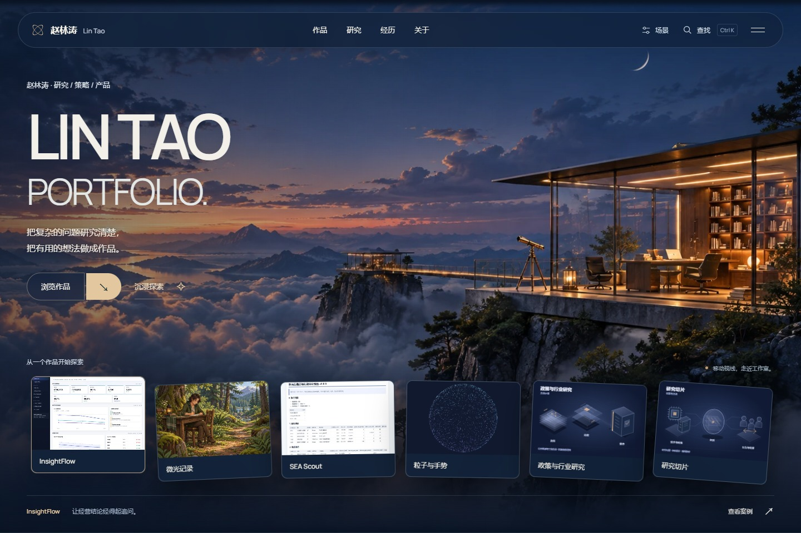
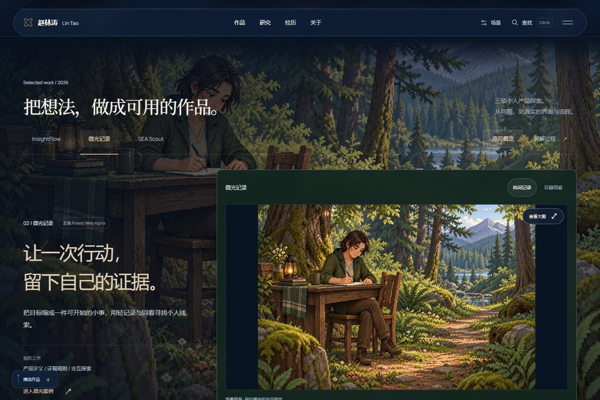
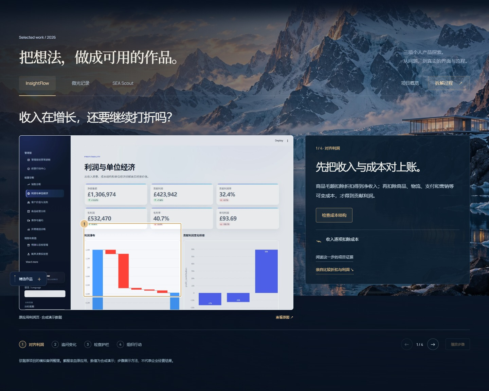
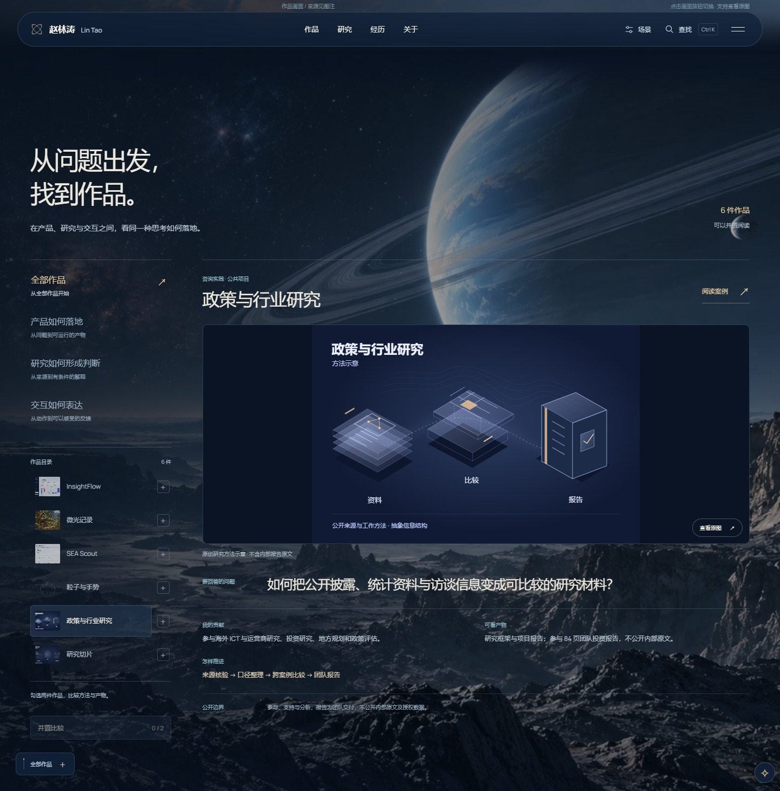
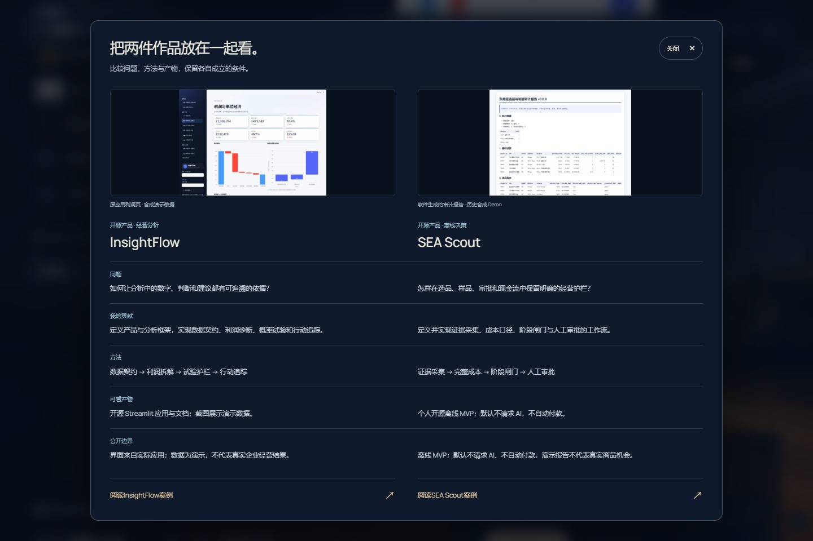
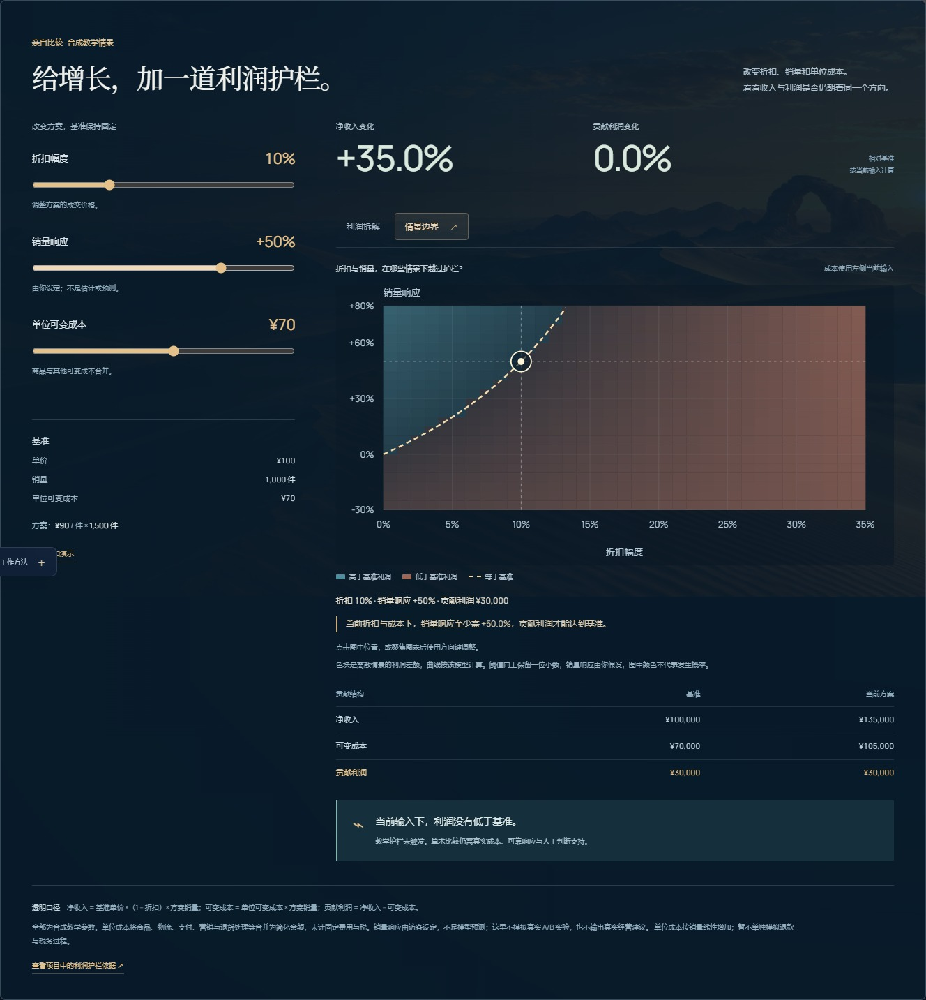
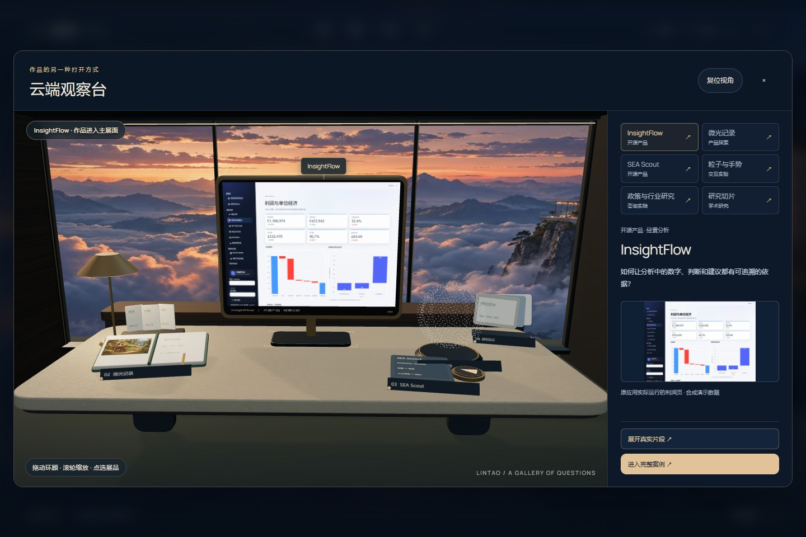

# Personal Site Studio · 个人主站工作室

**让访客认识你、看懂你的作品，并找到支持这些作品的真实证据。**

`personal-site-studio` 是供 Codex 使用的个人主站制作与升级 skill。你可以提供简历、项目目录、作品链接、报告或现有网站，让 Codex 按这套方法筛选内容、组织阅读路径、设计视觉与交互，并检查实际页面。

它适合这样的情况：你已经积累了不少经历和作品，却还需要把这些材料组织成一个完整的个人展示空间；或者，你已有主站，希望解决作品反复出现、操作层级过多、动效与内容脱节等具体问题。

下面的示例来自一个经过实际制作与多轮优化的个人主站。本仓库把其中可以复用的内容组织、设计、实现和审查经验整理成 skill。使用时，页面风格、技术栈与模块由你的资料和目标决定；示例站的效果还依赖其项目素材、既有实现和持续调整。

[查看在线示例](https://zhaolintao-portfolio.bb8btbb2zk.chatgpt.site) · [安装与开始使用](#安装与开始使用) · [可直接复制的调用示例](#可直接复制的调用示例) · [文件导航](#文件导航)

## 先看看它关注哪些体验

以下图片是与线上版本对应的本地构建在真实浏览器中的电脑端截图。它们展示页面构图、内容层次和交互状态；连续动效、镜头响应与操作反馈可以在在线示例中体验。

### 1. 首页：建立印象，也给出清楚的作品入口



首页用云端工作室景观建立视觉主题，同时保留姓名、方向、简介和作品入口的阅读顺序。景观与字体共同形成第一印象，访客随后可以从作品封面进入具体内容。设计时会优先考虑文字安全区、画面层次和入口位置，让背景与阅读共同成立。

### 2. 作品概览：先理解项目，再决定深入哪一项



这里展示“微光记录”的概览，画面使用用户提供的场景插画，表达项目的氛围与主题。介绍区说明项目解决的问题和作者的工作。共同的项目选择器让访客在作品之间切换，概览与拆解使用同一组项目状态。这种组织方式适合精简连续出现的多套完整画廊，同时保留不同深度的阅读入口。

### 3. 项目拆解：把结果背后的思考讲清楚



这里展示 InsightFlow 的四步拆解，访客可以沿着问题、分析和行动的顺序理解项目。项目界面与步骤说明相互对应，个人贡献也有明确位置。画面来自真实应用，经营数字为合成演示数据，不代表企业实绩。对于研究、产品或分析类作品，这比单独罗列工具名称更容易说明你做了什么、为何这样做，以及哪些内容可以核对。

### 4. 证据索引：按访客的问题找到合适的作品



这里选中“政策与行业研究”，用方法示意和说明呈现参与项目的工作及贡献边界。当作品类型较多时，访客可以从产品、研究或交互方向筛选，再阅读问题、贡献、交付、方法和边界。当前画面展示经过整理的方法表达，原始内部报告仍按其公开范围管理。

### 5. 作品比较：用一致的问题理解不同项目



这里将 InsightFlow 与 SEA Scout 并排展示，用一致的字段对照问题、个人贡献、交付和方法。两侧截图分别采用合成演示数据和历史合成 Demo，用于展示产品功能。这个交互适合需要判断能力迁移的读者：同一个人怎样处理不同情境，哪些方法可以复用，哪些结果取决于项目条件。比较模块按作品内容选用，字段先保持一致，再考虑视觉表现。

### 6. 情景沙盘：让访客通过操作理解分析方法



示例中的沙盘让访客调整折扣、假设销量响应和单位变动成本，观察贡献利润及维持基准利润所需的边界。图中使用折扣 10%、销量响应 50%、单位变动成本 70 的合成情景：收入比基准增加 35%，贡献利润保持不变。输入、图表、数字和解释同步更新，让读者理解收入增长与贡献利润之间的关系。销量响应由访客假设，色块表示模型中的利润差额，假设与适用范围在页面中明确说明。

### 7. 三维观察台：为作品增加一条空间探索路径



观察台把作品入口融入一个可探索的空间，访客可以通过展物和场景交互接近内容。它为喜欢探索的读者提供另一条浏览路径，文字介绍和常规案例入口仍然可用。空间体验适合与作品主题有关的站点，设计时同时考虑操作提示、退出路径、渲染负担和静态可用状态。

## 适合谁使用

| 你的情况 | 可以从哪里开始 |
| --- | --- |
| 有简历和作品，还没有个人主站 | 筛选代表材料，确定身份介绍、作品和联系方式的阅读顺序 |
| 项目资料很多，分散在多个本地目录 | 建立素材索引，找到可公开且能说明贡献的证据切片 |
| 已有网站，但同一批作品反复展示 | 合并完整介绍与重复入口，保留必要的预告、概览和案例 |
| 希望增加有辨识度的动效或交互 | 从内容主题选择景观、动效节奏和能解释作品的操作 |
| 只想修复某个页面或某项行为 | 直接处理对应部分，检查受影响的使用路径 |
| 已完成制作，需要发布或开放访问 | 沿用现有托管方案，按当前授权处理版本与访问范围 |

研究者、开发者、产品与分析从业者、独立创作者，都可以按自己的内容使用这套方法。最终页面可以是克制的文字作品集，也可以是包含景观和空间体验的主站。

## 开始前，准备这些材料

不必一次整理成完整文档。给出可以读取的目录、文件或链接，并说明哪些内容需要保留、哪些可以公开，便能开始筛选。

| 材料 | 最有用的信息 |
| --- | --- |
| 简历或个人介绍 | 展示名、身份方向、简介、经历、教育背景，以及当前可信版本 |
| 项目与作品 | 名称、解决的问题、你的角色、实际贡献、当前状态和可用链接 |
| 可展示证据 | 软件截图、图表、报告切片、源码说明、演示或已授权的图片 |
| 公开范围 | 联系方式、合作方、研究题目、数据和文件中哪些部分允许展示 |
| 现有网站 | 本地源码、技术栈、预览入口，以及需要保留的功能或设备版本 |
| 风格参考 | 喜欢的页面、截图或视频，以及具体喜欢的构图、节奏或交互 |

如果没有参考风格，可以让 Codex 结合内容提出设计方向。若资料较多，可以先提供目录，让它查找候选作品，再确认仍然缺失的关键事实。缺少成果数字时保留已经有证据支持的内容；论文、原型和团队项目使用各自的真实状态。

## 安装与开始使用

你需要在支持 skills 的 Codex 环境中使用本仓库。制作时还需要能够访问你提供的材料和项目；页面预览、图像生成或发布能力根据当前任务与可用工具选择。

### 方式一：让 Codex 安装

在支持 `skill-installer` 的环境中发送：

```text
从 https://github.com/zhao-yushen/personal-site-studio 安装 personal-site-studio。
```

### 方式二：手动安装

克隆或下载本仓库，将仓库文件放入 Codex 的 skills 目录，目录名称保留为 `personal-site-studio`：

```text
$CODEX_HOME/skills/personal-site-studio/
├── SKILL.md
├── agents/
└── references/
```

未设置 `CODEX_HOME` 时，通常使用 `~/.codex/skills/personal-site-studio/`。已经配置自定义 skills 目录时，沿用该目录。下载 ZIP 后确认 `SKILL.md` 直接位于 `personal-site-studio` 中，避免再嵌套一层仓库目录。

安装并让当前 Codex 环境识别技能后，在请求中写出 `$personal-site-studio`，再提供资料、目标与范围。

## 可直接复制的调用示例

### 从资料开始制作

```text
使用 $personal-site-studio 为我制作一个综合个人主站。

简历在：[简历路径]
作品资料在：[项目目录或链接]

请先筛选能说明我实际贡献的作品，再组织页面和设计视觉。
我希望访客能快速理解我的方向，并能继续查看项目证据。
手机号和原始研究数据不公开，其余展示范围以文件中的当前说明为准。
先完成本地制作和页面检查。
```

### 升级现有网站，减少重复展示

```text
使用 $personal-site-studio 优化这个个人主站：[项目路径]。

目前作品介绍在多个区域重复出现，项目操作也需要打开太多面板。
请梳理访客从首页到案例的路径，合并重复的完整介绍与入口。
保留现有手机版本，这轮主要升级电脑端。
云端景观是我喜欢的视觉主题，可以改善构图、过渡和交互细节。
```

### 研究互动方案，再决定实施

```text
使用 $personal-site-studio 研究这个主站的特色交互：[项目路径或链接]。

结合我的作品，提出能够帮助读者理解内容的方案。
说明访客怎样进入、操作、获得反馈和返回正文，以及实现成本。
这轮只给建议，不修改网站。
```

### 处理局部问题

```text
使用 $personal-site-studio 修复这个网站的作品切换：[项目路径]。

从完整案例返回后，选中的项目与可见内容有时不一致。
请复现并修复这一状态问题，检查切换、返回和深链接路径。
```

可以在请求中补充“沿用当前技术栈”“保留现有编辑能力”“发布到现有站点”等条件。制作范围会按当前请求确定；咨询、局部修复、整体改版和访问修改分别使用相应流程。

## 核心方法：从材料到可用主站

### 第一步：找到能支撑介绍的内容

先读取现有实现与候选资料，把内容映射到四个访客任务：认识这个人、理解作品、核对贡献、找到联系方式。资料较多时先建立索引，再读取相关报告、截图或源码，复用已经确认的事实与素材记录。

选择作品时综合考虑代表性、可说明性和证据质量。团队交付与个人贡献分别表述；真实软件截图、演示数据和概念插画各有清楚说明。公开展示优先使用能够看懂的切片，并保留必要上下文。

### 第二步：整理阅读路径，合并重复内容

首页预告帮助访客发现作品，概览帮助理解项目，拆解解释思考过程，完整案例提供更充分的证据。它们可以承担不同任务。遇到重复的完整介绍时，共享作品资料和选择状态，让读者在需要的深度之间切换。

操作也按用途整理：主要入口容易发现，共同状态的控件集中放置，次要功能按场景出现。新增模块之前，先说明它帮助访客完成什么事，再判断是否值得加入。

### 第三步：让视觉与交互围绕内容展开

先确定视觉主题、文字层次和作品媒体，再安排背景与动效。不同章节可以使用不同景观、光线和机位，并通过共同的色彩与过渡语言保持连贯。长文阅读区域降低运动密度，让截图和正文清楚呈现。

技术随目标选择：分层图片与 CSS 可以表达景深；Canvas 可以承担局部流动效果；WebGL 可以建立有空间关系的交互；有明确数值模型的内容可以用情景图解释。每种技术都需要对应的使用价值和可靠的静态状态。

### 第四步：实际打开，操作，再修复

审查同时查看画面和行为。页面是否可读、截图是否清楚、控件是否有反馈、暂停后是否仍可用，都要在实际浏览器中观察。涉及检索、对话框、图表或返回状态时，再验证相应的键盘、焦点、模型边界和导航路径。

发现具体问题后修复并复测相关路径。当前要求得到实现、事实与范围正确、主要阅读和操作可用且没有剩余阻断时交付。小改动使用必要的局部验证，已经确认且未受影响的结果可以复用。

## 可以按需增加哪些能力

| 能力 | 何时适合加入 | 设计时关注什么 |
| --- | --- | --- |
| 分章节景观与动效 | 内容有明确章节，希望建立连续的视觉叙事 | 景观差异、文字对比、转场节奏、暂停与减弱动态 |
| 本地检索与章节导航 | 作品或案例较多，读者需要快速定位 | 结果是否对应真实入口、键盘操作、关闭后的焦点 |
| 筛选与作品比较 | 作品共享可对照的字段，访客需要理解差异 | 一致的事实、贡献、交付、方法和边界 |
| 交互沙盘与图表 | 项目包含可解释的输入与结果关系 | 明确假设、统一计算、边界值和图文同步 |
| 空间探索或小游戏 | 与个人主题或作品有关，能形成有意义的体验 | 操作提示、反馈、退出、回到内容与渲染负担 |
| 编辑与 HTML 导出 | 现有项目已具备，或用户明确需要 | 编辑内容保留、导出重开、临时状态清理 |
| 发布与访问设置 | 已需要交付线上版本或开放网址 | 沿用托管方、版本一致、当前授权和访问范围 |

这些模块分别按需要选用。普通的个人介绍、作品整理和页面优化可以直接执行核心流程。实际可用能力还取决于当前项目、运行环境和工具配置。

## 怎样判断这一轮完成了

检查以本轮改动为依据，并保留能说明结果的页面画面或操作记录：

- **内容**：项目状态、个人贡献、图片性质和公开范围有依据。
- **阅读**：初次访问能理解方向，作品证据能看清，没有阻断阅读的重叠或溢出。
- **操作**：本轮涉及的切换、导航、检索、弹窗或图表在关键路径中可用。
- **动效**：正常播放、暂停和减弱动态时都能完成阅读与必要操作。
- **保留范围**：用户要求保留的设备版本或功能按实际影响验证。
- **交付**：本地结果或发布版本与本次要求一致，必要限制有说明。

本 skill 已完成格式校验，并在隔离的虚构作品页面中试用内容合并、操作精简、导航和手机版本保留。示例主站另有多轮实际页面审查。你的项目仍应根据本次材料、代码与环境检查对应行为；截图可以展示画面，交互可靠性需要实际操作验证。

## 文件导航

| 文件 | 你可以从中了解什么 |
| --- | --- |
| [SKILL.md](SKILL.md) | 技能入口、请求分流、制作流程与完成条件 |
| [内容与设计](references/content-and-design.md) | 怎样筛选材料、去除重复、组织视觉与选择技术 |
| [交互实现](references/interaction-engineering.md) | 怎样处理共享状态、动效、焦点、情景图和按需导出 |
| [验证与交付](references/verification-and-delivery.md) | 怎样查看实际页面、选择检查范围、修复并交付 |
| [发布与访问](references/hosting-and-access.md) | 怎样沿用托管方案、核对版本并管理访问范围 |
| [agents/openai.yaml](agents/openai.yaml) | Codex 中的展示名称与默认调用提示 |
| [页面截图](docs/screenshots/) | 本说明展示的个人主站界面 |

## 参考来源与使用范围

本 skill 提供制作方法与实施注意事项。使用时从当前任务获取身份、作品、目录、风格和站点配置；示例站中的个人内容与素材有各自的权利和公开范围。

示例主站沿用了 [Personal Homepage Skill](https://github.com/shengjidaguai-china/personal-homepage-skill) 的部分文本编辑与 HTML 导出运行时。原作者为 **powerycy**，项目来自**升级打怪开源社区**；原项目采用 **Personal Homepage Skill Non-Commercial License**。本 skill 在需要这些能力时可以配合已安装的原 skill 使用，复用相应内容时遵守其非商业使用、署名和商业授权要求。

示例中的 Three.js 使用其 MIT 许可；项目截图、用户提供的插画及概念景观分别按其来源和授权使用。本仓库中的截图用于介绍实际页面效果。引用、转载或进一步使用文档、图片和第三方实现时，请遵循各自的权利与许可范围。
